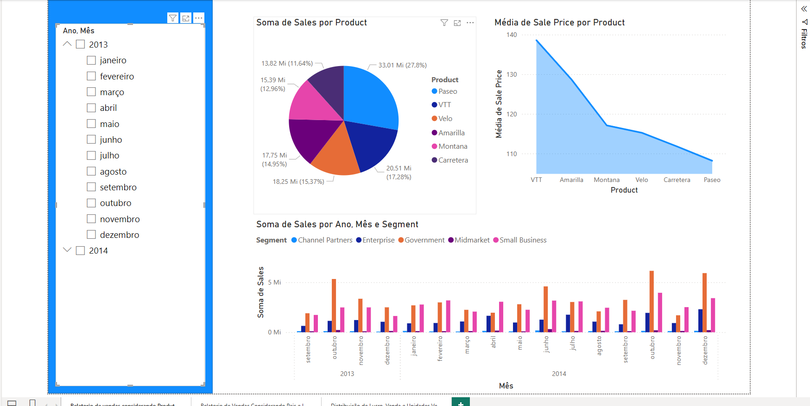
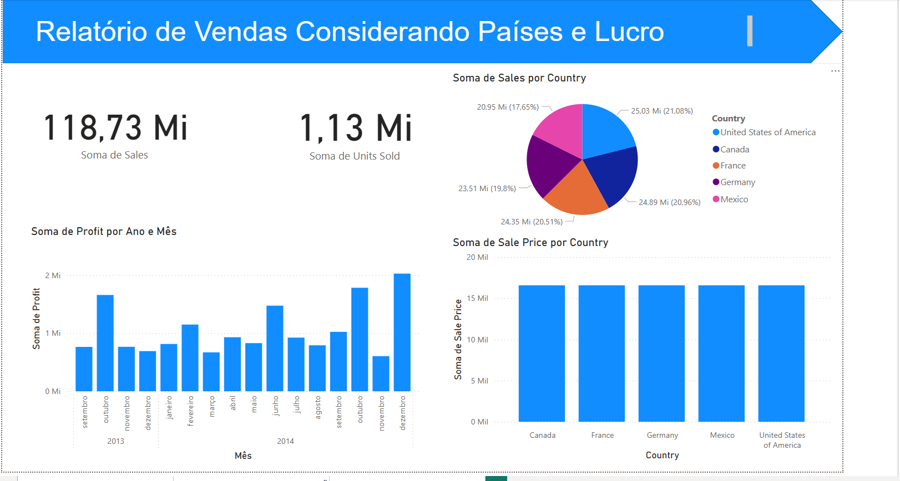
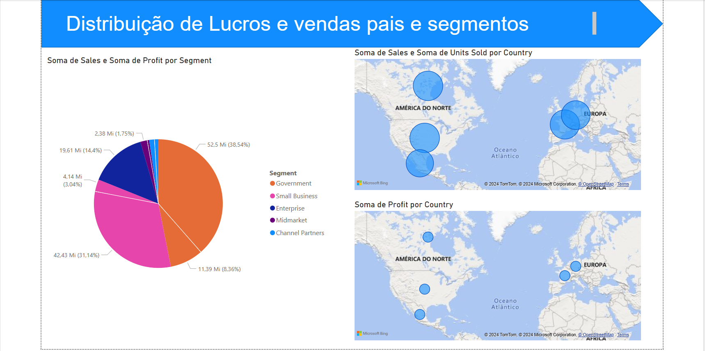

# DesafioPowerBI

'Neste desafio vamos por em pratica o estudo voltado aos conceitos basicos de BI, como a contrução de dashboards e logica de ETLe ELT.'

# Desafio Proposto

Descrição do desafio: Vamos para o primeiro desafio com Power BI? Neste projeto você irá replicar duas páginas já criadas durante o curso com a sample disponibilizada. Acesse o link do Gihub para ter acesso aos dados: 

https://github.com/julianazanelatto/power_bi_analyst 

A terceira página, a qual vocês irão criar sozinhos, deve conter alguns visuais. Esse desafio visa treinar a habilidade de criação de visuais. Assim, você poderá criar familiaridade com esses recursos. Em módulos mais avançados iremos tratar do layout mais elaborado dos nossos relatórios.  

Muito bem, a terceira página é composta por: 

* Visual mapa 1: Soma de sales e unidades vendidas por país 

* Visual mapa 2: Soma de lucro (profit) por país 

* Visual de pizza: Lucro por segmento 

Além disso: 

* Verifique a disposição dos visuais no relatório 

* Modifique os nomes dos visuais para algo mais claro e direto (de acordo com o contexto) 

* Preste atenção aos campos que são utilizados como dicas de ferramentas  

* Publique o relatório 

* Compartilhe como suplemento no Power Point 

* Caso não tenha Power Point, salve o projeto de Power BI  

## Resolução e Resultado dos desafios

### Recriação da pagina 1

### Recriação da pagina 2

 ### Recriação da pagina 3
